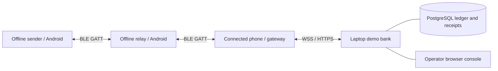
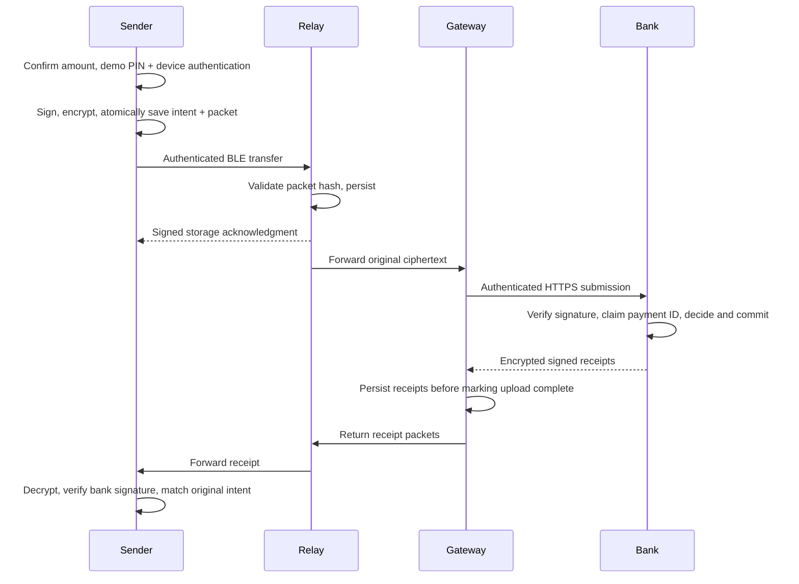

# Architecture and technology choices

## Product boundary

BeyondNet moves a signed payment instruction without internet on the sender. It does not move settled value independently of the bank. An internet-connected gateway submits opaque ciphertext; the bank decides and signs the outcome. The same phone app can be a customer, recipient, relay, gateway, or several roles at once.

The physical topology is discovered, not hardcoded. A four-hop budget bounds each packet’s propagation. Optional identity allowlists create a controlled demonstration chain. Receipt replication prefers peers appearing in the request’s reverse path and falls back to other eligible peers. It cannot guarantee a byte-for-byte identical return route when phones leave; signed receipts can travel through another available route.

## Stack

| Layer | Implementation | Reason |
|---|---|---|
| Native mobile UI | Flutter / Dart, Material 3 | Android UI and protocol implementation |
| Nearby transport | `bluetooth_low_energy` 6.2.1, Android BLE | Central and peripheral APIs on Android; no internet dependency |
| Phone persistence | SQLite through `sqflite` | Durable packets, intents, receipts, config, and redacted events |
| Phone secret storage | `flutter_secure_storage` | OS-protected storage for device seeds and session data |
| Authorization | `local_auth` | Native biometrics/device credential confirmation |
| Recipient exchange | `mobile_scanner`, `qr_flutter` | Bank-signed identity QR; works after enrollment without internet |
| Cryptography | Dart `cryptography`, Java JCA and Bouncy Castle | Cross-language Ed25519 and X25519/HKDF/AES-GCM interoperability |
| Bank | Java Spring Boot | HTTP and WebSocket service with explicit authorization boundaries |
| Bank persistence | PostgreSQL JDBC, transaction-scoped advisory locks | Atomic ledger/receipt decisions and safe concurrent idempotent retries |
| Laptop console | Local HTML/CSS/JavaScript, authenticated polling | No separate frontend build process; shows committed bank data |

The phone is a native Flutter app using an authenticated BLE GATT protocol. The bank is Java Spring Boot with PostgreSQL; phone SQLite remains local offline storage. iPhone and Wi-Fi mesh are not released. No real bank/UPI adapter is included.

## Account types, funding and connectivity

Version 1.2.1 has customer/personal and merchant accounts. Relay is an opt-in capability on either, with automatic gateway operation whenever internet and the bank are reachable. Signup creates a zero-balance account. Funding uses a persistent `(account, request_id)` key, an atomic account credit and offsetting `demo-funding` ledger entry. The phone saves an unresolved top-up ID before sending it.

Android reports validated internet connectivity through a native method channel. The app separately verifies bank reachability/trust on launch, resume and every five seconds. A bank outage is not reported as internet being off. Online own payments submit without enabling Bluetooth. Offline new payments require a recently verified, explicitly selected nearby peer. Existing saved packets keep retrying even after a route disappears.

`/api/live` accepts a session token and registered device ID in its first WSS frame. It submits the same encrypted packets as HTTPS, returns decisions, streams durable per-device encrypted receipts and refreshes account balances. The server checks session expiry/revocation continuously. Disconnects use idempotent HTTPS submission and mailbox/device-inbox recovery. The server polls its local database each second for live updates; the phone does not need to poll for each WebSocket status message.

## Enrollment

1. User supplies a bank HTTPS origin and compares the full trust fingerprint with the laptop.
2. The app reads bank public keys and verifies the fingerprint **before sending credentials**.
3. Signup or account login returns a seven-day session.
4. Device signing/encryption keys and device ID are generated and stored together in secure storage.
5. The app proves possession of its signing key and registers its public keys under the authenticated account.
6. The bank issues a 30-day signed device certificate with account, display name, public keys, mesh identity, and expiry.
7. Verified recipient certificates and the bank public keys are cached for offline use.

Renewal keeps the same device keys. A changed bank identity or different account is refused for an existing installation. There is no destructive in-app reset.

## Payment flow

Every phone retains a stored packet until retention cleanup. No relay acknowledgment deletes the sender’s original. A receiver only acknowledges application storage after the database operation succeeds. BLE write success itself is not a storage acknowledgment.

## Financial state versus transport state

| Display | Meaning |
|---|---|
| Queued | Original instruction is saved locally |
| Relayed | A bank-enrolled peer acknowledged storage |
| On its way / awaiting receipt | No verified final bank decision yet |
| Outcome not yet known | Local authorization expired but no verified outcome arrived |
| Payment confirmed | Bank-signed success verified against the original parties/amount |
| Payment rejected | Bank-signed rejection verified |

The displayed balance is a labeled bank snapshot. Signed receipts carry a ledger revision so delayed receipts cannot roll it backward. The UI does not pretend the cached balance subtracts all in-flight authorizations.

## Bank transaction

A PostgreSQL transaction-scoped per-bank advisory lock serializes writers before checking balances, including separate Java instances. The bank verifies the registered sender’s signature and compares the full canonical request hash for `(sender, payment_id)`.

For a new valid instruction it checks the authorization window, parties, and funds. Success updates both balances and creates matching debit/credit rows. Rejection records the decision without ledger entries. In the same transaction, the bank signs and encrypts receipts and saves recovery mailboxes and an event. Any exception rolls everything back.

Signing inside the small demo transaction removes the need for a separate outbox worker. Retrying a committed payment returns the same saved receipt packets. Reusing its payment ID with different content conflicts. A recorded insufficient-funds rejection never becomes a success after a later balance change.

## Persistence and restart

Bank identity lives under `data/` (or `KARO_DATA_DIR`); this deployment stores its PostgreSQL ledger on Neon. The retired local cluster has been removed. Phone intents and ciphertext queues live in application SQLite; key seeds and the login session use secure storage. Restarting the app reconstructs receipt delivery from retained ciphertext, then the user explicitly starts Nearby relay again. Relay does not silently restart in the background. Online connectivity monitoring and direct own-payment recovery restart automatically while the app is open.

Receipts live for seven days; new requests are authorized for 10 minutes. Expired payment packets remain cached for seven more days to support mailbox recovery, but are no longer submitted as new authorizations or forwarded. Permanent own payment history is preserved. There is no automatic cancellation or refund feature.

## Observability

The laptop console displays actual committed bank events, balances, decisions, and ledger entries. It does not receive live radio diagnostics from the phones. Phone **Nearby** logs show local packet storage and gateway activity. The console’s software rehearsal explicitly labels its radio hops as simulated; it runs real crypto and bank settlement, not real Bluetooth.

## Platform references

- [Android Bluetooth permissions](https://developer.android.com/develop/connectivity/bluetooth/bt-permissions): Android 12+ requires scan/connect/advertise runtime grants.
- [BLE plugin documentation](https://pub.dev/documentation/bluetooth_low_energy/latest/index.html): supported native central/peripheral APIs. The dependency is pinned in the project.

See [Java setup and class map](SPRING_BOOT_SETUP.md) for PIN storage, verified legacy migration, backup, and current startup commands. The hybrid envelope remains X25519/HKDF/AES-GCM with Ed25519 signatures; the encrypted payment body is v2. Expiry never reverses a committed payment.
