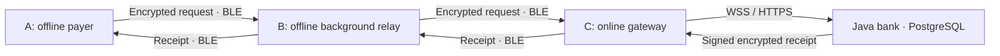

# Background relay and offline chains — BeyondNet 1.3.0

## Phone setup

Install `installers/BeyondNet-Android-1.3.0.apk` over the existing app on every relay phone. Do not uninstall or clear data: enrollment keys, receipts and unresolved requests are retained. Bank API, URL, trust fingerprint and PostgreSQL are unchanged; this update requires no bank restart.

Enroll online once, then enable **Nearby relay** while BeyondNet is visible. Grant Nearby devices on Android 12+, or Location while using the app with Location on for Android 10–11. Android 13+ asks for notification permission; denying it does not block the service, but Android may show its Stop control only in active-apps controls. Confirm the relay notification, then leave the app or lock the screen. Offline relays need Bluetooth, supported BLE advertising and valid enrollment. Only the gateway needs internet access to the bank.

Stop from the app switch or notification's **Stop relay**. Bluetooth off pauses forwarding and releases the CPU lease; on resumes an enabled service. After reboot, open BeyondNet to resume saved opt-in. Force-stop and Android's active-apps Stop control halt execution. Device-specific battery restrictions can interrupt it; the Nearby screen links to battery settings. Permissions may be revoked, so the service checks readiness again instead of assuming a one-time grant is permanent.

Active relay consumes battery: discovery/advertising stay active, and a timed partial wake-lock lease keeps scheduling/transfer work running with a locked screen. It does not keep the screen awake. The lease refreshes while the service is healthy, expires if maintenance stalls and is released on pause/stop. This release prioritizes demo delivery over all-day power efficiency. No guarantee of execution after OS/user termination is claimed.

## Implementation

`RelayEngineHost.kt` owns one application-scoped Flutter engine. `MainActivity` attaches a screen to it without creating another queue or destroying it on screen removal. `RelayService.kt` is a user-visible `connectedDevice` foreground service (also `location` on Android 10–11), with `stopWithTask=false`, persistent opt-in, sticky restart support and a Stop notification. There is no boot receiver or hidden startup. Dart initializes eagerly without a Flutter view, restoring keys/queues and replaying receipts. Background work never prompts for permissions or authorizes new payments.

`background_relay.dart` reconciles native state with `engine.dart`. Enabled user intent, running service and operational radio are separate states. Missing permissions, Bluetooth off and expired enrollment show paused status. SQLite schema v2 adds durable per-peer custody acknowledgements; upgrades retain v1 queues/history. Transactions use FULL synchronous durability. The app ID and signing identity remain compatible for in-place upgrades.

## Routing rules



The bank is outside the radio chain. It needs an internet endpoint, not Bluetooth proximity. The receipt can use another available route if the original neighbours disappear.

1. Authenticate every peer RPC and bank-issued enrollment certificate; require the same pinned bank and optional identity allowlist.
2. Exchange signed packet inventories. New inventories include IDs, kind and hop counts; old ID-only v1 inventories remain supported.
3. Transfer missing packets and strictly shorter routes. Persist and validate the whole packet before a custody ACK. A signed inventory repairs an ACK lost after storage. A successful BLE write alone is not custody or payment success.
4. Prefer recently observed online gateways. Limit each packet/node to three acknowledged offline custodians during a 90-second window; online gateways and known receipt return-path peers are exempt. Expiring the window permits alternate neighbours after custodians disappear. This bounds fanout per node, not copies across the entire network.
5. Skip previously visited devices. Payment `path` is its request history; an optional `trail` tracks each packet's own traversal so receipts can retrace the payment path without cycling around their own route. Routing changes do not change immutable ciphertext/packet ID. Old relays do not implement the new trail rules, so install 1.3.0 throughout a test chain.
6. Keep sender copies, persist custody, and deduplicate immutable IDs. A strictly shorter route replaces routing metadata without resetting upload state. Multiple gateways may submit duplicates; the bank's existing ID/hash check and atomic transaction still produce one financial result.
7. Interleave receipt/payment queues, prefer return-path receipts and earlier expiry, limit eight transfers per direction/contact, rotate neighbours and use randomized retry backoff. Fanout-blocked entries do not consume the transfer budget.
8. Submit through WSS/HTTPS and persist returned receipts before marking upload complete. Return receipts through the preferred reverse path or alternate available routes. Only a verified, decryptable bank receipt updates financial outcome/balance.

The four-transfer limit and signed **600-second authorization** remain. Forwarding never renews expiry. Expired unprocessed requests cannot settle; already committed payments stay paid and their receipts have longer retention. No usable chain within the window means no unprocessed settlement; an absent receipt means recover the original outcome, not presume cancellation.

Routing hints are authenticated per hop, not a cryptographic proof of physical route history. A dishonest enrolled peer can lie about reachability or drop packets. It cannot use those hints to authorize money or forge bank receipts. The system remains a demo, not real UPI or independently audited financial software.

## Physical acceptance

Use A payer offline, B relay offline, C gateway online. Enroll all and save/scan the recipient certificate before disconnecting. For a deterministic test, set allowlists: A accepts B; B accepts A/C; C accepts B. This excludes accidental A–C contact even when radio ranges overlap. Repeat with actual separation where only A–B and B–C have usable signal.

Enable relay on all three, leave B's app and lock its screen. Send a small demo payment on A. Confirm B custody, C upload, one bank debit/credit and matching signed receipt on A. A must have no hotspot/internet/direct gateway link. Repeat with B swiped from Recents, interrupted transfers, Bluetooth off/on and restored service. Force-stop should intentionally halt forwarding; reopening must preserve the queue. Test supported Android 10/11 and 12+ models and manufacturer battery controls.

Add D and break B's return path, permitting C–D–A. Test two competing gateways and check one debit. Check expiry and no looping. Measure latency, range, advertising support and battery use. Automated tests do not establish these hardware results; no phones were connected during implementation.

## Reproducible checks

```sh
cd mobile
flutter analyze
flutter test --exclude-tags integration
flutter test test/live_bank_test.dart
cd android
./gradlew :app:testDebugUnitTest
cd ..
flutter build apk --release
```

Live integration uses temporary keys and an isolated PostgreSQL test schema with the packaged Java bank. Robolectric runs real Android service preferences/lifecycle/notification/wake-lock checks for API 29/34, replacing only Flutter JNI. Dart faults exercise actual signing, framing, production sync/storage/routing with explicitly controlled links, not RF hardware.
