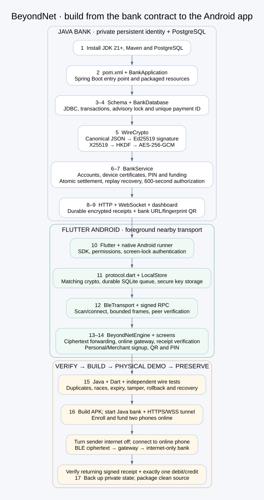

> **Current laptop configuration:** PostgreSQL is now on Neon. The launcher uses the private remote configuration and skips local database startup. See [Neon setup and restart guide](NEON_SETUP.md). Local-cluster instructions below apply only to a fresh local development setup.

# BeyondNet: developer build flow, from Java to Android

This is an implementation order for understanding or rebuilding the current code, rather than a claim about the project's historical development order. Start with the bank contracts, prove them with tests, then build the Flutter client against those contracts. The finished product is a **demo payment system**, not a real UPI integration.



Editable diagram sources: [Mermaid](diagrams/build-flow.mmd) and [Graphviz](diagrams/build-flow.dot). The payment journey is a separate [runtime flowchart](diagrams/payment-flow.svg).

## 1. Prepare a Java project, not a Python virtual environment

Install a **JDK 21 or newer**, Maven, PostgreSQL 17+, Git, Flutter 3.44+ with Dart 3.12+, and Android Studio/SDK. Confirm `java -version`, `mvn -version`, and `flutter doctor -v`. Android uses minimum API 29, compile SDK 37, target SDK 36 and NDK 28.2.13676358. Resolve Flutter doctor warnings affecting Android before building.

Java dependencies belong in Maven, Flutter dependencies in Pub. A Python `.venv` is optional until independent tests or utilities are needed; it does not run the bank.

Start with this structure:

```text
BeyondNet/
  backend/pom.xml
  backend/src/main/java/com/beyondnet/bank/
  backend/src/main/resources/
  backend/src/test/java/com/beyondnet/bank/
  mobile/lib/                  mobile/test/                mobile/android/
  tests/support/              tests/fixtures/
  scripts/                    docs/diagrams/
  data/                       installers/                  dist/
```

`data/`, build caches, signing secrets and `dist/` are ignored. A source checkout cannot contain an existing bank's secret identity. Preserve those separately when moving an existing bank.

## 2. Define the Maven build and first Java entry point

Create [backend/pom.xml](../backend/pom.xml) with Java 21, Spring Boot 4.1.1, the Web MVC and WebSocket starters, PostgreSQL JDBC, Jackson, Bouncy Castle, ZXing, and Spring Boot Test. Versions are pinned in the existing POM; retain them when reproducing this checkout. The SQLite JDBC driver is for the one-time Java legacy importer only.

Create [BankApplication.java](../backend/src/main/java/com/beyondnet/bank/BankApplication.java) in package `com.beyondnet.bank`. `@SpringBootApplication` enables component discovery; `SpringApplication` starts the service. `--migration-only` supports database preparation without running an HTTP listener.

Create [application.properties](../backend/src/main/resources/application.properties) with a loopback listener on port 8080. The tunnel exposes HTTPS/WSS externally; PostgreSQL stays private. Use normal Maven resources so the schema and dashboard travel inside the executable JAR.

Checkpoint: Maven compiles the package. The bank will need database configuration before it can finish startup.

## 3. Prepare persistent PostgreSQL and configuration

Implement [scripts/start-postgres.sh](../scripts/start-postgres.sh) to initialize a dedicated local cluster, a restricted application role and random SCRAM password. This Mac's database runs on `127.0.0.1:5433`, separate from any other PostgreSQL installation. Save its JDBC URL/user/password in private `data/postgres.properties`.

For an existing database, use [postgres.properties.example](../backend/src/main/resources/postgres.properties.example) or `BEYONDNET_DB_URL`, `BEYONDNET_DB_USER`, `BEYONDNET_DB_PASSWORD`. Use database TLS for remote hosting. `BEYONDNET_DB_CONFIG` selects the configuration file; `KARO_DATA_DIR` is the retained compatibility name for the private bank directory.

Create [schema.sql](../backend/src/main/resources/schema.sql):

| Table | Why it exists / crucial invariant |
|---|---|
| `accounts` | User identity, role, salted password hash and balance in integer paise; nonnegative balance constraint |
| `sessions` | Account-scoped expiring login tokens |
| `devices` | Registered signing/encryption public keys, signed certificates and revocation state |
| `payment_pins` | Salted PIN hash, failed attempts and lock deadline; no plaintext PIN |
| `payments` | Durable decision, canonical request hash and exact saved receipt bundle; primary key `(sender,id)` |
| `ledger` | Debit/credit audit entries and balance snapshots; financial history survives restarts |
| `topups` | Unique `(account,request_id)` prevents duplicate funding |
| `mailboxes` | Capability-based recovery of encrypted receipt bundles |
| `device_receipts` | Per-device receipt inbox with monotonic sequence cursor and unique packet ID |
| `events` | Redacted operator events |
| `migration_meta` | Records successful one-time legacy import |

Phone SQLite comes later; it is an offline queue, not the bank ledger. A phone cannot depend on an internet database for offline persistence.

## 4. Implement JDBC transactions before payment business logic

Create [BankDatabase.java](../backend/src/main/java/com/beyondnet/bank/BankDatabase.java). Essential imports are `java.sql.*`, `java.nio.file.*`, file channels and Spring's `@Component`/`@PreDestroy`.

- Constructor: load configuration, validate schema identifier, enforce a PostgreSQL JDBC URL, restrict private directory permissions, obtain the local identity-directory lease and create/apply schema.
- `read`: run nonmutating queries through a JDBC connection.
- `tx`: begin a transaction, acquire a PostgreSQL transaction-scoped advisory lock **before financial reads**, execute work and commit, or roll back on failure.
- `one`, `rows`, `scalar`, `execute`: bind values in prepared statements; never concatenate account input into SQL.
- `event`: write bounded/redacted audit information in the same transaction where appropriate.

This implementation serializes writers per bank schema, including multiple Java instances. The lock plus uniqueness constraints protect read/check/write operations from concurrent duplicate gateways and overspending. It is deliberately simple for a small demo; it limits throughput and is not a scalable payment architecture by itself.

Implement [LegacySqliteImport.java](../backend/src/main/java/com/beyondnet/bank/LegacySqliteImport.java) only for existing data: open old SQLite read-only, import into an empty target, compare every row/count, repair sequences, commit a migration marker. Reject an unmarked nonempty target. Import errors roll back. After migration, normal banking never reads/writes SQLite.

## 5. Specify identical signed bytes in Java and Dart

Create [WireCrypto.java](../backend/src/main/java/com/beyondnet/bank/WireCrypto.java) before controllers. Its contract must match [mobile/lib/protocol.dart](../mobile/lib/protocol.dart) exactly.

Key imports: Jackson `ObjectMapper`/`JsonParser`, JCA `SecureRandom`/`MessageDigest`, `javax.crypto.Cipher`, `GCMParameterSpec` and `SecretKeySpec`; Bouncy Castle `X25519Agreement`, `HKDFBytesGenerator`, `SHA256Digest`, `Ed25519Signer`, `SCrypt` and key parameter types.

Implement these functions in this order:

1. **Canonical JSON and digest:** recursively sort object keys, reject floating-point/unsupported values, duplicate JSON keys and excessive nesting; encode UTF-8. Java and Dart must sign exactly the same bytes.
2. **Ed25519 key generation, `sign` and `verify`:** sign the canonical body and reject changed content. Enrollment binds each signing key to its device/account; a random public key is not sufficient authorization.
3. **`seal` / `openBox`:** generate a fresh ephemeral X25519 key, agree a shared secret with the destination public key, derive a 32-byte AES key with HKDF-SHA256, encrypt with AES-256-GCM. Salt includes ephemeral and destination public keys; the retained domain is `offline-karo/box/v1`. GCM uses a random 12-byte nonce and 16-byte tag. Reject low-order/all-zero agreement results and tag failures.
4. **Packet construction/validation:** bind immutable ciphertext fields to a SHA-256 packet ID and enforce size/shape, mailbox, expiry and hop bounds. Routing fields are mutable hints and never authorize a bank transfer.
5. **scrypt:** hash passwords and PINs with random salts; verify hashes rather than storing secrets in plaintext.

The hybrid encryption is **X25519 + AES**, not RSA + AES. It retains existing key/wire compatibility. Ed25519 authenticates the signed instruction; AES-GCM detects ciphertext modification. Relays see routing metadata and ciphertext, not amount, parties or PIN inside the instruction. This is not forward secrecy for recorded messages if the bank's long-term decryption key is later compromised, nor a traffic-analysis defense.

Checkpoint: known canonical bytes, signatures and encrypted fixtures agree across Java, Dart and the independent Python oracle. Do not proceed with mismatched crypto.

## 6. Build trusted enrollment, accounts and demo PIN setup

Create [BankException.java](../backend/src/main/java/com/beyondnet/bank/BankException.java) for controlled status/errors and [BankService.java](../backend/src/main/java/com/beyondnet/bank/BankService.java) for bank rules. Persist bank signing/encryption keys and operator token once in private files; load them on subsequent starts.

Implement `health`, `signup`, `login`, `account`, `me`, `snapshot`, `register`, `recipient` and `configurePin`:

- Public health returns the bank's public identity. The app hashes it and checks the expected 64-hex fingerprint **before sending credentials**.
- Signup creates Personal or Merchant accounts at zero balance; relay is not an account role. New payment IDs follow the signup validation in the service.
- Login returns an expiring random session, not a permanent password in every request.
- Registration requires the authenticated account and proof of device signing-key possession. Bank-signed device certificates authorize nearby identities and recipient encryption keys.
- PIN setup/reset requires an online session plus account password. Hash the six-digit demo PIN with scrypt; payment PIN and phone screen-lock code are different.
- Five distinct wrong-PIN attempts lock authorization for ten minutes. Replaying an already-recorded rejection must not increment attempts again.

Add [demo-accounts.json](../backend/src/main/resources/demo-accounts.json) only as demo seed configuration. Normal signup must work without adopting those credentials. A source copy with fresh data creates a new bank identity; it does not inherit this laptop's accounts.

## 7. Implement atomic funding and immediate settlement

Implement `BankService.topup`: persist a request ID, perform a single account credit plus offsetting demo-funding ledger entry, and return the same result for a retry. This money has no real-world value.

Implement `BankService.ingest` in this order:

1. Validate outer packet, decrypt bank-only ciphertext, validate exact signed body fields/version and verify against the registered sender device.
2. Compute the canonical full-body hash. Enter `BankDatabase.tx` and look up `(sender,payment_id)` before applying expiry or PIN attempt effects.
3. For a recorded matching hash, return **the original saved receipt packets**. Different content with the same key returns conflict. Re-encryption or a different gateway does not cause another debit.
4. For a new instruction, recheck revocation, sender/recipient/enrolled devices, creation time and expiry. New payments use body v2 with encrypted PIN and a maximum **600-second authorization lifetime**.
5. Verify PIN, lock state, available balance and bank policy. A legacy PIN-less instruction cannot create a new debit.
6. On success debit sender, credit recipient, create paired ledger rows, bank reference and signed receipts. On a business rejection save its final rejected decision without financial entries.
7. Encrypt receipts separately for the sender and recipient device keys. Save decision, receipt bundle, mailboxes, inbox entries and event in the same transaction. If receipt generation/persistence fails, **all financial writes roll back**.

Use integer paise throughout; do not use floating-point amounts. A payment received at the bank before expiry settles immediately: there is no ten-minute waiting period. A first arrival after the deadline cannot debit. An already-committed payment remains paid even if the receipt arrives after expiry. The app may show unknown outcome when it cannot obtain that authoritative receipt; that is not an automatic refund.

Checkpoint: prove duplicate/re-encryption/conflict/overspending/tamper/PIN/expiry/rollback/restart behavior before adding a radio transport.

## 8. Expose one bank API and live receipt transport

Create [BankController.java](../backend/src/main/java/com/beyondnet/bank/BankController.java) using Spring MVC mappings. Delegate rules to `BankService`; enforce account/operator authorization at endpoint boundaries. [PROTOCOL.md](PROTOCOL.md) describes endpoint and envelope contracts.

Create [RequestLimits.java](../backend/src/main/java/com/beyondnet/bank/RequestLimits.java) to bound request bodies and rate/response behavior. The demo's process-local limits are not a distributed abuse-defense system.

Create [LiveSocket.java](../backend/src/main/java/com/beyondnet/bank/LiveSocket.java) using Spring WebSocket types. Require account token and enrolled device ID in the first frame within ten seconds, then pass submissions to the same `ingest` as HTTP. Poll the durable device inbox each second, stream encrypted receipts and balance updates, recheck session/revocation, synchronize socket sends. HTTPS remains the recovery path after WSS disconnects.

The bank has **no Bluetooth component**. Its only external phone input is internet HTTP/WSS through HTTPS/WSS termination. Desktop range relative to the phones is irrelevant; nearby range matters between participating phones.

## 9. Package the dashboard and setup QR with Java

Put HTML, JavaScript and CSS in [backend/src/main/resources/static/](../backend/src/main/resources/static/). [StaticAssets.java](../backend/src/main/java/com/beyondnet/bank/StaticAssets.java) maps dashboard assets from the JAR. Operator authentication gates private state/actions.

Implement [BankSetupQr.java](../backend/src/main/java/com/beyondnet/bank/BankSetupQr.java) with ZXing to encode **both HTTPS URL and bank trust fingerprint**, plus `type=beyondnet-bank-setup` and `v=1`. Validate an HTTPS origin and exclude secrets. The dashboard can generate/download a PNG; optional public URL configuration prefills the form.

[RehearsalService.java](../backend/src/main/java/com/beyondnet/bank/RehearsalService.java) supplies a clearly labeled software demonstration. It creates additional demo records instead of deleting existing accounts/history. Its radio hops are simulated; it is not evidence of physical mesh transmission.

Checkpoint: packaged JAR serves dashboard, operator authorization works, setup QR decodes, malformed URL is rejected.

## 10. Create the Flutter Android shell and dependencies

For a truly new reconstruction, initialize Flutter with Android as its platform. **Do not regenerate the existing native runner** when updating this project: it contains permission, authentication and connectivity configuration.

Read [mobile/pubspec.yaml](../mobile/pubspec.yaml):

| Package | Purpose |
|---|---|
| `cryptography` | Same wire crypto as Java |
| `sqflite`, `path_provider` | Durable local queue, intents/history and database location |
| `flutter_secure_storage` | Device secret seeds and session data |
| `bluetooth_low_energy` | BLE central/peripheral GATT |
| `permission_handler` | OS permission setup |
| `local_auth` | Native screen-lock/biometric confirmation |
| `mobile_scanner`, `image_picker` | Camera QR scan or QR image selection |
| `qr_flutter` | Merchant/recipient QR display |
| `http` | HTTPS API/fallback; Dart `dart:io` supplies WebSocket |
| `uuid` | Unique payment/top-up/device identities |

Implement [main.dart](../mobile/lib/main.dart) after core services are testable. It wires app initialization, account/signup screens, Personal/Merchant UI, balance/funding, Pay, Nearby, receipts and settings. Android's [native runner](../mobile/android/) supplies the Internet/SDK/Location method channel, Bluetooth permissions, FragmentActivity for native authentication, and disabled Android backup. Keep the existing app ID for upgrades.

## 11. Implement Dart protocol and durable phone state

Create [protocol.dart](../mobile/lib/protocol.dart) with canonical JSON/sign/verify/seal/openBox/makePacket/checkPacket matching step 5. Import `dart:convert`, typed byte support and the Dart cryptography package. Use the interoperability tests rather than guessing cross-language encoding.

Create [store.dart](../mobile/lib/store.dart), class `LocalStore`, with `init`, `putPacket`, `createPayment`, `markRelayed`, `putReceipt`, configuration/peer/event queries and bounded cleanup:

- Save the encrypted packet and redacted owned intent in one SQLite transaction before reporting it queued.
- Persist incoming packets before acknowledging storage.
- Keep the original until authoritative recovery is possible. Relay state must never overwrite a paid/rejected state.
- Keep owned unresolved history after authorization expiry; expire relay forwarding/retention according to policy.
- Keep device private keys/session in secure storage, not payment rows. Do not persist the plaintext PIN.

Checkpoint: restart/duplicate receipt tests show no lost intent, repeated debit or rolled-back final status.

## 12. Implement actual BLE store-and-forward transport

Create [nearby_permissions.dart](../mobile/lib/nearby_permissions.dart) and [ble_transport.dart](../mobile/lib/ble_transport.dart). Key transport concepts/classes are `PeerRadio`, `BleTransport`, `Assembly` and frame encoding.

- Android 12+: runtime Nearby devices scan/connect/advertise grants. Android 10–11: foreground Location grant and Location switch. Bluetooth must be on; the app does not need coordinates.
- Advertise a service as a BLE peripheral and scan/connect as a central; use the retained service/characteristic UUIDs.
- Split JSON into conservative 20-byte GATT frames: one byte of start/end flags and up to 19 bytes payload. Reassemble with timeout/size limits (12 KiB RPC bound).
- Verify bank-signed peer certificates and signed RPCs, reject expired/replayed or invalid peer messages, then exchange bounded packet inventories and missing packets.
- Persist opaque ciphertext, deduplicate by packet ID, increment routing hop metadata on forwarding and enforce the four-hop bound. The bank does not trust route hints for financial authorization.
- Receipt exchange prioritizes the recorded reverse route, with alternate eligible paths when a phone has left. Four hops and ten minutes are different bounds: one limits replication, the other financial authorization.

This is **application-level store-and-forward over BLE**, not the standardized Bluetooth Mesh networking stack. Version 1.3.0 adds [relay_routing.dart](../mobile/lib/relay_routing.dart), [background_relay.dart](../mobile/lib/background_relay.dart) and native `RelayEngineHost`/`RelayService`: durable custody ACKs, path/trail loop avoidance, shorter-route updates, bounded fanout and one retained engine in a notification-backed Android foreground service. Enabled phones may close/lock the screen. Wi-Fi Direct remains future work; measure physical range, power and advertising support on actual phones. See [BACKGROUND_RELAY.md](BACKGROUND_RELAY.md).

## 13. Connect payments, internet gateways and receipts in the engine

Create [engine.dart](../mobile/lib/engine.dart), class `BeyondNetEngine`:

- `init`, `loadKeys`, `enroll`: restore durable state, verify bank trust and enroll stable device identity.
- `startMonitoring`, `checkConnection`: separately track validated phone internet and bank reachability on open/resume and while visible.
- `openLive`, `readLive`, `submitPacket`, `gatewayTick`: WSS direct submission/live receipts, HTTPS fallback, durable inbox/mailbox recovery. An online relay can upload other phones' ciphertext.
- `findRecipient`, `addRecipient`, `connectNearby`: cache verified recipient certificates; require explicit verified connection for a new offline payment.
- `pay`: collect PIN/native authorization, use one creation timestamp, sign body v2, encrypt to bank and atomically save intent/ciphertext with `expires_at=created_at+600`.
- `signedRpc`, `validateRpc`, `handleRpc`, `syncPeer`, `forwarded`, `accept`: authenticated inventory/packet exchange, hop limits and durable peer storage.
- `deliverReceipt`: decrypt for this device, verify bank signature, match original sender/recipient/amount/payment ID, save final outcome. Ledger revision prevents stale receipt snapshots from rolling the balance backward.
- `tick`, `retryNow`, `dispose`: retry retained work, bounded cleanup and orderly transport shutdown.

Either Personal or Merchant may enable relay. It is a capability, not a third user type. An online user can pay directly without Bluetooth. An offline payer needs a nearby participating route that eventually reaches an online gateway; a storage acknowledgment means only that a peer saved ciphertext.

## 14. Add PIN, setup QR and payment UI last

Implement [payment_pin.dart](../mobile/lib/payment_pin.dart) for online setup/reset and payment entry; clear/dispose entered text. Native device authentication is a separate local authorization step.

Implement [bank_setup_code.dart](../mobile/lib/bank_setup_code.dart) for strict typed QR parsing and [bank_setup_scan.dart](../mobile/lib/bank_setup_scan.dart) for camera scan and gallery decode. Handle canceled pickers, lost-image recovery, malformed/ambiguous codes and wrong type. Review parsed bank details before populating fields. The gallery path must not start the camera.

`main.dart` now combines these into a normal payment UI. Show offline permission/connect instructions when needed, bank failure separately from no internet, and **confirmed** only after signed receipt verification. The bank QR conveys trust details but must come from a trusted dashboard; embedding an attacker fingerprint would not prove bank legitimacy.

## 15. Run checks before building a distributable APK

From the project root:

```sh
python3 -m venv .venv
.venv/bin/python -m pip install -r requirements-test.txt
./scripts/check.sh
```

This runs:

- Java tests under `backend/src/test/`: crypto, bank decisions, PostgreSQL races, PIN policy, rollback, TTL, restart and QR bounds.
- Flutter analyzer and `mobile/test/`: framing/routing/store/permissions/QR/UI/receipt state plus live Dart-to-Java integration.
- Independent `tests/test_java_bank.py` and `tests/test_dart_interop.py`: HTTP/WebSocket/wire compatibility and frozen synthetic legacy-ledger migration. `tests/support/wire_oracle.py` is test-only Python, never a server.

Random `test_*` PostgreSQL schemas and temporary identities isolate tests from the public bank. Software tests do not establish BLE range/reliability, native camera/gallery behavior or production financial security.

Build:

```sh
cd mobile
flutter pub get
flutter build apk --release
```

Output: `mobile/build/app/outputs/flutter-apk/app-release.apk`. Confirm version, API compatibility and signing certificate before updating installed phones. Local installer copies are not packaged in the source ZIP. New checkouts need their own Android SDK paths/dependency downloads; existing-phone upgrades need the matching signing key.

## 16. Start from this laptop and prove a real two-phone flow

1. From the project root run `./start-bank.sh`. On this Mac it connects to Neon (fresh local setups can start local PostgreSQL), builds Java if needed and runs an immutable JAR copy. Keep this window open.
2. Open `http://localhost:8080`. Read the operator key with `cat data/admin-token.txt`, then unlock the dashboard.
3. In another terminal run `./Start-Ngrok.command` if ngrok is not already running. Keep it open. This laptop's assigned address is saved locally; use the URL from the running tunnel. The laptop must stay awake and online.
4. Generate a bank setup QR in Device setup. Install APK 1.3.0 on Android 10+ phones; scan/select the QR. Signup/enroll online, configure demo PIN and fund the payer. Use three phones to demonstrate an offline intermediate; see [BACKGROUND_RELAY.md](BACKGROUND_RELAY.md).
5. First prove a small online payment. Match payment ID, bank reference, receipt and balances across both phones/dashboard.
6. Keep the second phone online with relay enabled and visible. Turn off internet on the payer, leave Bluetooth enabled, grant required permissions, scan and connect. Pay by ID or recipient QR.
7. Confirm the returned bank-signed receipt on the payer, incoming receipt on the merchant, and exactly one debit/credit on the bank. The laptop need not be near either phone.
8. Add an optional third offline relay only after two-phone success. Use allowlists if you need to demonstrate that the middle phone carried the request rather than a direct radio path.

Do not claim mesh success from the console's rehearsal. Record actual phone models, OS versions, topology and observed request/receipt behavior. See [FIRST_PAYMENT.md](FIRST_PAYMENT.md).

## 17. Preserve the bank and package clean source

Stop with Ctrl+C and restart with the same launch command; PostgreSQL and key files preserve accounts/decisions/fingerprint. Use `./scripts/backup-bank.sh` for a private database dump plus identity/configuration backup. A tunnel disconnect affects reachability, not stored balances. Recover unresolved original payments before making replacements.

Run `python3 scripts/package_source.py`; output is `dist/BeyondNet-source.zip`. Do not distribute `data/`, signing keys, SDK paths, caches or private backups. The cleaned project no longer contains the Python bank or unfinished iPhone source. The local cleanup archive in `data/backups/` preserves removed files without putting obsolete runtime code into the source package.

Future work: physical background/multi-hop acceptance and reliability/power metrics, Wi-Fi transport, production signing/key recovery, scalable database locking/pooling, deployment/monitoring, independent security review and authorized real payment integration. Android background relay is implemented in 1.3.0.
